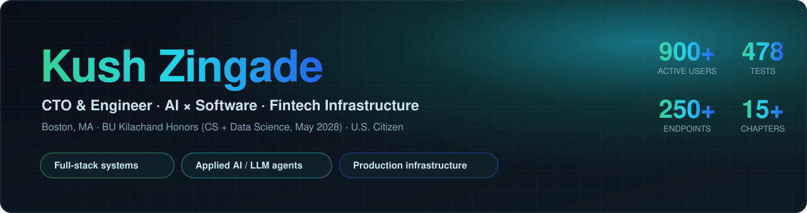
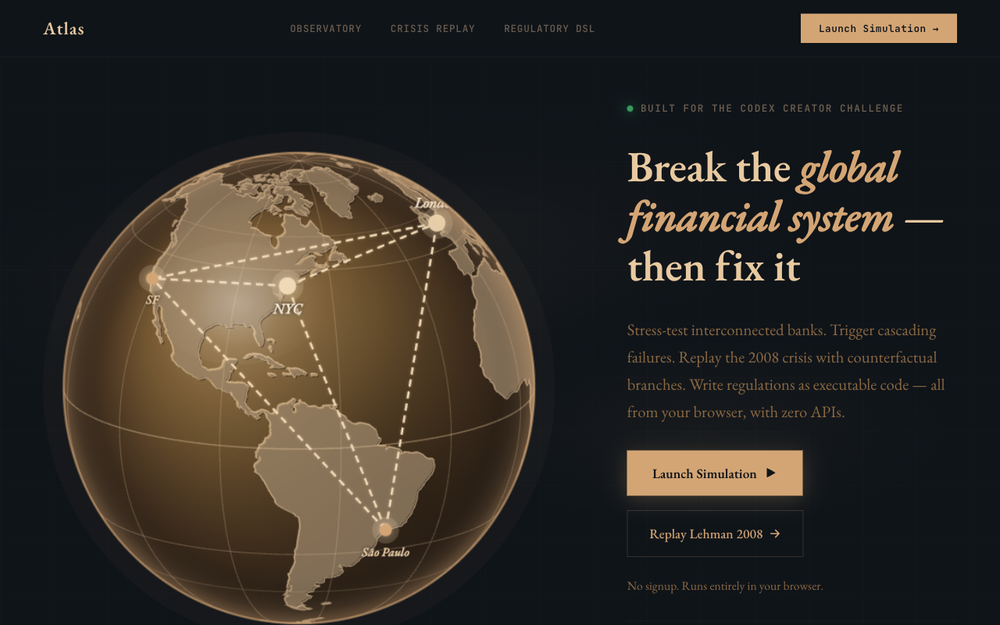
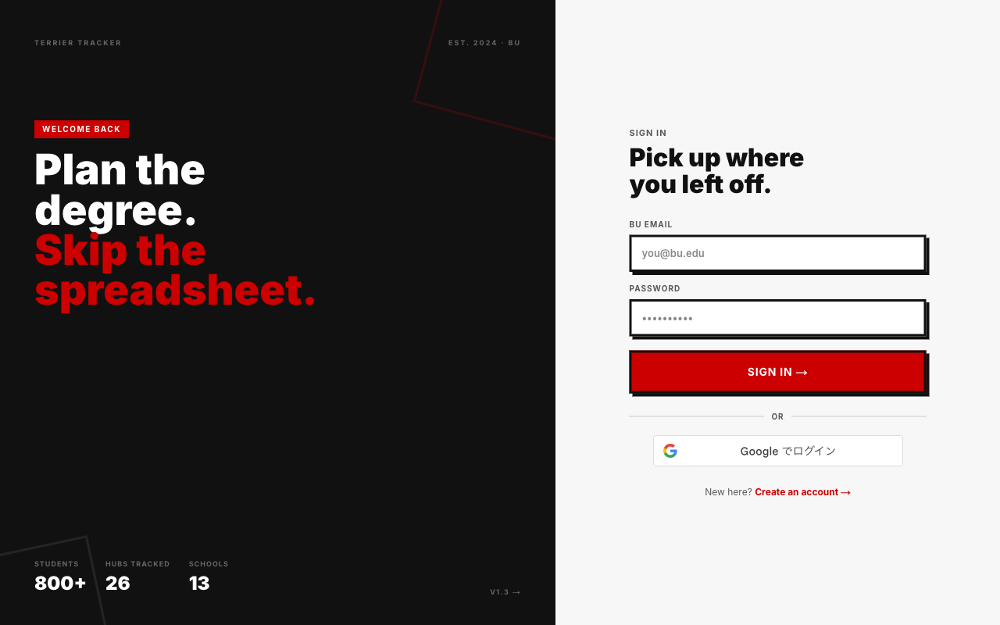
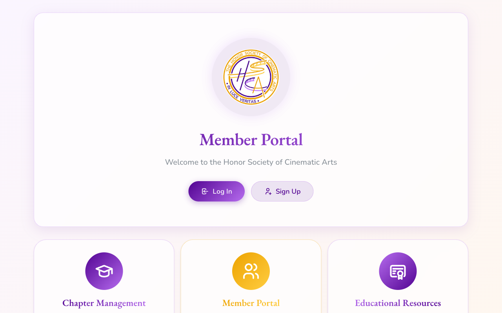
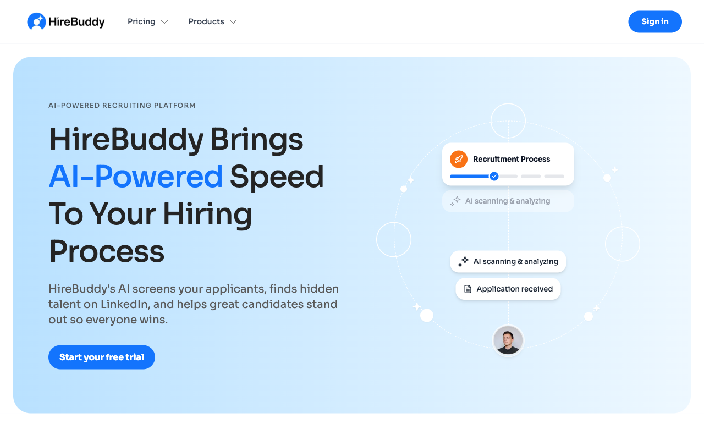
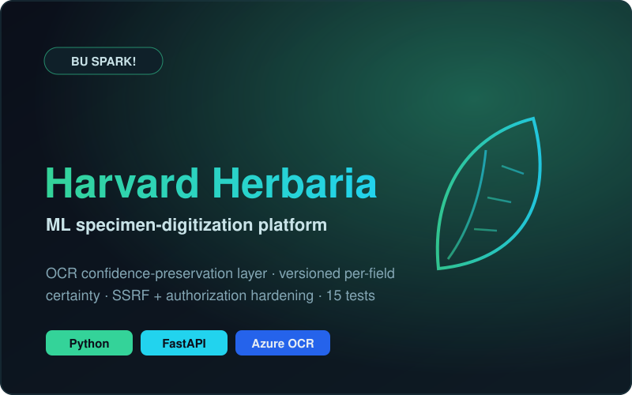
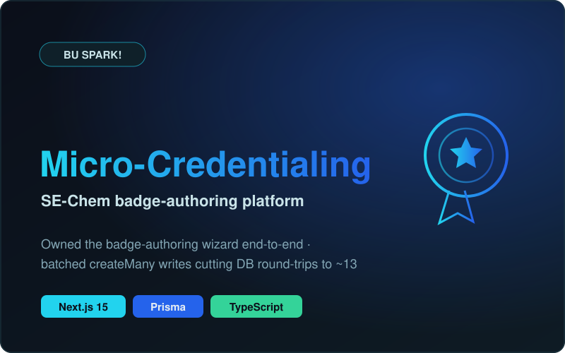
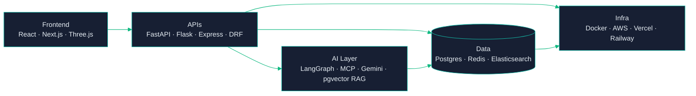

  
  
  
  

> **Accelerated CS @ Boston University — but I'd rather show you what I've shipped.**
> A degree planner used by ~900 students, a nonprofit's entire 250+ endpoint platform, and award-winning AI agents.

### 📈 Contribution activity

---

### 🧩 Currently building

<table>
<tr>
<td width="25%" align="center" valign="top"> <b>CTO & Sole Engineer</b> Honor Society of Cinematic Arts  Multi-tenant platform · 250+ endpoint API · live across 15+ chapters & 150+ members</td>
<td width="25%" align="center" valign="top"> <b>SWE Intern</b> BU Spark!  Harvard Herbaria OCR confidence layer (FastAPI) + micro-credentialing platform</td>
<td width="25%" align="center" valign="top"> <b>SWE Intern</b> Doro (Local Treasure)  TikTok OAuth, Stripe checkout & moderation tooling (Django/DRF)</td>
<td width="25%" align="center" valign="top"> <b>Research Assistant</b> BU CISS  Financial markets × geopolitical uncertainty · Python data workflows</td>
</tr>
</table>

Previously — AI & Software Engineer Intern @ HireBuddy · Lead Software Engineer @ Hack4Impact BU

---

### 🚀 Featured work

<table>
<tr>
<td width="50%" valign="top">

#### 🏦 Atlas — Digital Twin of the Global Financial System
Autonomous banks, central banks & payment rails (RTGS/ACH/SWIFT/CLS/DTCC), systemic-risk analysis, crisis replay & a hand-written regulatory DSL.

<a href="https://atlas-kzingade.vercel.app"><b>▶ Live demo</b></a> · <a href="https://github.com/UgaTheDev/Atlas">Code</a>

</td>
<td width="50%" valign="top">

#### 🎓 Terrier Tracker
Degree planning for **~900 BU students** across 6,000+ courses. Gemini + pgvector RAG recommender; Redis layer at **~81% hit rate** over 66k+ lookups.

<a href="https://terriertracker.vercel.app"><b>▶ Live demo</b></a>

</td>
</tr>
<tr>
<td width="50%" valign="top">

#### 🎭 HSCA Portal
The production system of record behind my CTO role — member lifecycle, payment-gated resources, evaluation forms & a film festival, with per-chapter tenant isolation.

<a href="https://hscaportal.vercel.app"><b>▶ Live</b></a>

</td>
<td width="50%" valign="top">

#### 🤝 HireBuddy — AI Recruiting Platform
Built the AI candidate-sourcing engine (Elasticsearch-DSL over CoreSignal) — **tripled candidates surfaced per search (100 → 300)** — and co-built a GPT-4o-mini pre-screening engine scoring across 10 evidence-backed dimensions.

<a href="https://hirebuddy.ai"><b>▶ Live product</b></a>

</td>
</tr>
<tr>
<td width="50%" valign="top">

#### 🌿 Harvard Herbaria &nbsp;@ BU Spark!
OCR confidence-preservation layer for a specimen-digitization ML platform — a versioned per-field certainty envelope surfacing Azure vision-OCR to reviewers, plus SSRF + authorization hardening.

Client-owned (BU Spark!) — no public repo

</td>
<td width="50%" valign="top">

#### 🎖️ Micro-Credentialing &nbsp;@ BU Spark!
Owned the SE-Chem badge-authoring wizard end-to-end — decomposed an 843-line page into components, killed a stale-closure bug, and batched `createMany` writes cutting DB round-trips to ~13.

Client-owned (BU Spark!) — no public repo

</td>
</tr>
</table>

#### ✨ Highlights

<table>
<tr>
<td width="33%" align="center"><b>🏆 InstructLab KnowFlow</b>  LangGraph + MCP agentic workflow automating InstructLab contributions — accepted for upstream evaluation.</td>
<td width="33%" align="center"><b>🥈 Cognify</b>  AI course & career advisor over 6,000+ BU courses with Gemini recommendations & skill-gap analysis.</td>
<td width="33%" align="center"><b>⚛️ Quantum Explorer</b>  Interactive 3D quantum-entanglement platform with AI-powered concept grading.</td>
</tr>
</table>

---

### 🗺️ How I build

---

### 🧰 Stack

 

 

 

---

🏆 Best Use of AI, Red Hat–IBM &nbsp;·&nbsp; 🥈 2nd Place, BU DS+X 2025 &nbsp;·&nbsp; ✦ Code &amp; Tell — Audience Choice

